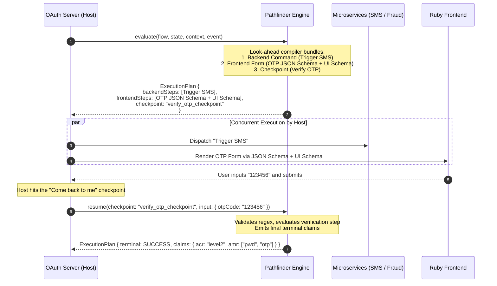

# Pathfinder: Language-Agnostic Decision Engine

Pathfinder is a lightweight, language-agnostic decision engine designed for OAuth servers and session orchestration. It evaluates the current session state and context, executes look-ahead planning, and determines what additional data needs to be gathered or what backend checks should run.

## Key Capabilities

1. **Language-Agnostic YAML/JSON Graph**: Decision workflows are stored as declarative state charts with zero host-language dependencies.
2. **Google CEL for Conditional Guards**: `if` statements are defined using [Common Expression Language (CEL)](https://github.com/google/cel-spec) (`results.riskScore >= 50 && !context.user.mfaEnrolled`), ensuring identical execution semantics across Java, Ruby, and TypeScript.
3. **Server-Driven UI for Ruby**: Emits standard **JSON Schema** (for input types, required fields, and regex patterns) + **UI Schema** (for widget selectors and placeholders) that any Ruby frontend can dynamically render.
4. **Composite Step Bundling**: Bundles multiple backend commands AND multiple frontend steps together into a single `ExecutionPlan` before yielding.
5. **"Come Back To Me" Checkpoint Pattern**: Yields explicit checkpoints when human interaction or external async backend results are required to evaluate subsequent branches.
6. **Pure Inversion of Control (IoC)**: The engine does not make HTTP calls or touch databases; it emits pure command descriptors for the host OAuth server to execute.

---

## Architecture



---

## Example Flow Definition (`oauth_stepup_auth.yaml`)

```yaml
id: oauth-stepup-auth
version: "1.0.0"
name: "OAuth 2.0 Step-Up Authentication Flow"
initialState: evaluate_auth

states:
  evaluate_auth:
    type: BACKEND
    commands:
      - id: fetch_user_profile
        service: user-directory
        payload:
          userId: "${context.userId}"
      - id: check_device_risk
        service: fraud-engine
        payload:
          ip: "${context.ip}"
          deviceId: "${context.deviceId}"
    on:
      - if: "results.check_device_risk.riskScore < 30"
        target: issue_basic_token
      - default: true
        target: trigger_stepup_mfa

  trigger_stepup_mfa:
    type: COMPOSITE
    commands:
      - id: send_otp_sms
        service: notification-service
        payload:
          userId: "${context.userId}"
          channel: "SMS"
    schemas:
      - screenId: otp_entry_screen
        title: "Two-Factor Verification Required"
        description: "A 6-digit verification code has been dispatched to your registered phone."
        jsonSchema:
          type: object
          required:
            - otpCode
          properties:
            otpCode:
              type: string
              pattern: "^[0-9]{6}$"
              title: "6-Digit Security Code"
        uiSchema:
          otpCode:
            "ui:widget": "otp"
            "ui:placeholder": "123456"
            "ui:autofocus": true
    on:
      - event: SUBMIT
        target: verify_otp

  verify_otp:
    type: BACKEND
    commands:
      - id: verify_code
        service: otp-service
        payload:
          code: "${context.otpCode}"
    on:
      - if: "results.verify_code.valid == true"
        target: issue_stepup_token
      - default: true
        target: auth_failed

  issue_basic_token:
    type: TERMINAL
    terminal:
      status: SUCCESS
      claims:
        sub: "${context.userId}"
        acr: "urn:pathfinder:auth:level1"
        amr: ["pwd"]

  issue_stepup_token:
    type: TERMINAL
    terminal:
      status: SUCCESS
      claims:
        sub: "${context.userId}"
        acr: "urn:pathfinder:auth:level2"
        amr: ["pwd", "otp"]

  auth_failed:
    type: TERMINAL
    terminal:
      status: DENIED
      error: "Invalid verification code provided."
```

---

## Multi-Language Ecosystem Parity

| Layer | Java (Current POC) | Ruby (`pathfinder-rb`) | TypeScript (`@pathfinder/engine`) |
| :--- | :--- | :--- | :--- |
| **CEL Expressions** | `dev.cel:cel` | `gem 'cel'` | `cel-js` / `@google/cel` |
| **JSON Schema Validation** | `json-schema-validator` | `gem 'json_schemer'` | `ajv` |
| **YAML / JSON Parser** | Jackson | `YAML` / `JSON` (stdlib) | `yaml` / native `JSON` |
| **Execution Loop** | Stateless pure function | Stateless pure function | Stateless pure function |

---

## Running the Tests

```bash
mvn clean test
```
