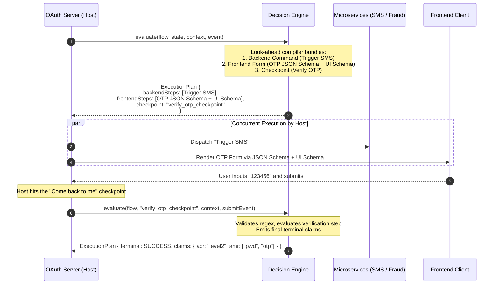
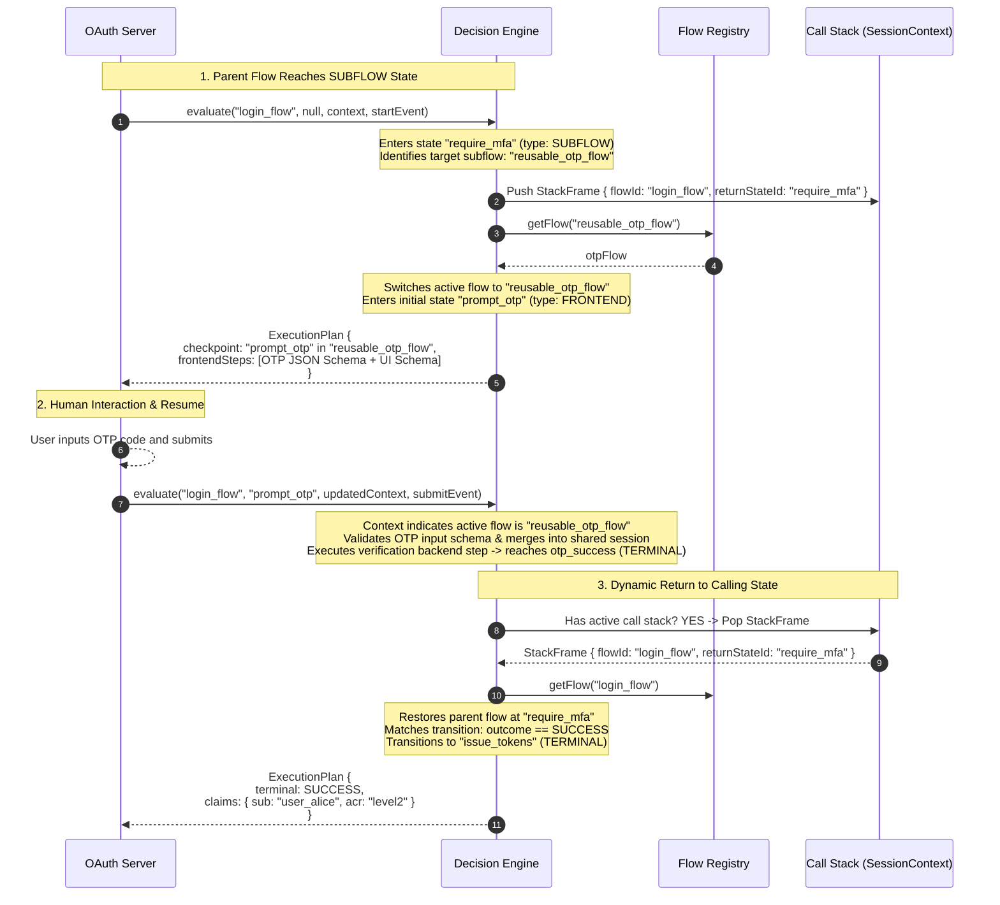

# Decision Engine: Declarative Orchestration for OAuth & Session Flows

**Decision Engine** is a lightweight, language-agnostic decision engine designed for OAuth servers, identity verification, and multi-step session orchestration. It evaluates the current session state and context, executes look-ahead compilation, and determines what additional data needs to be gathered or what backend checks should run.

---

## Key Capabilities

1. **Declarative State Charts**: Workflows are stored as language-agnostic YAML or JSON state charts with zero host-language dependencies.
2. **Google CEL for Conditional Guards**: `if` statements and payload templates are evaluated with [Common Expression Language (CEL)](https://github.com/google/cel-spec) (`results.riskScore >= 50 && !context.user.mfaEnrolled`), ensuring identical execution semantics across Java, Ruby, and TypeScript.
3. **Server-Driven UI**: Emits standard **JSON Schema** (for input types, required fields, and regex patterns) alongside **UI Schema** (for widget selectors and placeholders) so any frontend client can dynamically render forms.
4. **Composite Step Bundling**: Bundles multiple backend commands AND multiple frontend steps together into a single `ExecutionPlan` before yielding.
5. **"Come Back To Me" Checkpoint Pattern**: Yields explicit checkpoints whenever human interaction or external async backend results are required to evaluate subsequent branches.
6. **Reusable Subflows & Call Stack**: Call independent, reusable subflows (e.g. OTP, Passkey, Consent) from any point in a flow. The engine maintains an execution call stack and dynamically returns to the exact calling point upon completion.
7. **Shared Session Context**: Subflows seamlessly read from and write to the shared session data, eliminating manual parameter mapping.
8. **Modular File Splitting (`includes`)**: Split large monolithic state machines across multiple YAML fragment files merged at parse time.
9. **Pluggable Flow Registries**: Discover and resolve flows on demand via classpath (`ClasspathFlowRegistry`), filesystem directory (`FileSystemFlowRegistry`), or in-memory map (`InMemoryFlowRegistry`).
10. **Pure Inversion of Control (IoC)**: The engine does not make network calls or touch databases; it emits pure command descriptors for the host OAuth server to execute.

---

## Architecture

### 1. Core Turn-Based Evaluation Loop



---

### 2. Reusable Subflows & Call Stack Return



---

## State Types Reference

| State Type | Description |
| :--- | :--- |
| `BACKEND` | Declares commands for the host to dispatch to backend microservices. |
| `FRONTEND` | Emits Server-Driven UI schemas (`jsonSchema` + `uiSchema`) for client rendering. |
| `COMPOSITE` | Combines both backend commands AND frontend screens in a single turn. |
| `DECISION_FORK` | Pure branching node evaluated with CEL conditions without external steps. |
| `SUBFLOW` | Suspends current flow, pushes a call stack frame, and delegates to a child flow. |
| `TERMINAL` | Concludes flow execution and resolves terminal status, OAuth claims, or error messages. |

---

## Transition Evaluation, Fast-Pathing & Step Bypassing

Every state defines an `on:` list of transition rules. Because the Decision Engine employs look-ahead compilation, **any bypassed step is completely skipped**—its backend commands are never dispatched and its frontend screens are never rendered.

### Evaluation Namespaces

Inside `if` conditions (evaluated via Google CEL), four distinct namespaces are available:

| Namespace | Source | Example Use Case | Example CEL Expression |
| :--- | :--- | :--- | :--- |
| `results.<cmdId>.<field>` | Asynchronous backend command responses | Fast-pathing low-risk users or failing fast on fraud | `results.fraud_check.riskScore < 30` |
| `input.<fieldName>` | User form submissions | Bypassing optional steps if the user clicks "Skip" | `input.action == 'SKIP'` |
| `context.<variable>` | Shared session context | Skipping steps if device is trusted or IP is internal | `context.deviceTrusted == true` |
| `outcome` / `subflow.<field>`| Completed subflow terminal status | Routing to success or fallback based on subflow result | `outcome: SUCCESS` or `subflow.status == 'SUCCESS'` |

### Bypassing Patterns

#### 1. Fast-Pathing (Happy Path Bypasses MFA)
```yaml
assess_risk:
  type: BACKEND
  commands:
    - id: risk_engine
      service: fraud-service
      payload: { ip: "${context.ip}" }
  on:
    - if: "results.risk_engine.score < 25"
      target: issue_tokens               # Bypasses all MFA steps entirely!
    - default: true
      target: require_mfa_challenge
```

#### 2. Failing Fast (Immediate Lockout)
```yaml
evaluate_credentials:
  type: BACKEND
  commands:
    - id: verify_pwd
      service: auth-service
  on:
    - if: "results.verify_pwd.accountLocked == true"
      target: account_locked_screen      # Bypasses remaining checks, locks immediately
    - default: true
      target: check_second_factor
```

#### 3. User-Driven Opt-Out / Skip
```yaml
prompt_biometric_setup:
  type: FRONTEND
  schemas: [ ... ]
  on:
    - if: "input.choice == 'REMIND_LATER'"
      target: dashboard_token            # Bypasses enrollment
    - default: true
      target: register_passkey_subflow
```

#### 4. Context Updates on Transition
Transitions can also mutate the shared session context using CEL expressions via `contextUpdates`:
```yaml
on:
  - if: "results.verify_code.valid == true"
    target: issue_tokens
    contextUpdates:
      mfaVerified: "true"
      authTime: "now()"
      assuranceLevel: "'urn:auth:level2'"
```

---

## Flow Definition Examples

### 1. Main Flow Calling a Reusable Subflow (`main_login_flow.yaml`)

```yaml
id: main_login_flow
version: "1.0.0"
name: "Primary Login Flow"
initialState: assess_login_risk

states:
  assess_login_risk:
    type: BACKEND
    commands:
      - id: fraud_check
        service: fraud-engine
        payload:
          ip: "${context.ip}"
          userId: "${context.userId}"
    on:
      - if: "results.fraud_check.riskScore >= 50"
        target: invoke_mfa
      - default: true
        target: issue_standard_token

  invoke_mfa:
    type: SUBFLOW
    subflow: reusable_otp_flow
    on:
      - outcome: SUCCESS
        target: issue_stepup_token
      - outcome: DENIED
        target: mfa_rejected

  issue_standard_token:
    type: TERMINAL
    terminal:
      status: SUCCESS
      claims:
        sub: "${context.userId}"
        acr: "urn:auth:level1"

  issue_stepup_token:
    type: TERMINAL
    terminal:
      status: SUCCESS
      claims:
        sub: "${context.userId}"
        acr: "urn:auth:level2"
        mfa_method: "${context.mfaMethod}"

  mfa_rejected:
    type: TERMINAL
    terminal:
      status: DENIED
      error: "Authentication failed: MFA challenge rejected"
```

### 2. Reusable Subflow (`reusable_otp_flow.yaml`)

This flow is completely independent and can be called from login, password reset, or transaction approval:

```yaml
id: reusable_otp_flow
version: "1.0.0"
initialState: prompt_otp

states:
  prompt_otp:
    type: FRONTEND
    schemas:
      - screenId: otp_entry_screen
        title: "Two-Factor Verification Required"
        description: "Enter the 6-digit passcode sent to your phone."
        jsonSchema:
          type: object
          required: [otpCode]
          properties:
            otpCode:
              type: string
              pattern: "^[0-9]{6}$"
              title: "6-Digit Security Code"
        uiSchema:
          otpCode:
            "ui:widget": "otp"
            "ui:placeholder": "123456"
            "ui:autofocus": true
    on:
      - event: SUBMIT
        target: verify_otp

  verify_otp:
    type: BACKEND
    commands:
      - id: verify_code
        service: otp-service
        payload:
          userId: "${context.userId}"
          code: "${context.otpCode}"
    on:
      - if: "results.verify_code.valid == true"
        target: otp_success
        contextUpdates:
          mfaMethod: "'SMS_OTP'"
      - default: true
        target: otp_failed

  otp_success:
    type: TERMINAL
    terminal:
      status: SUCCESS

  otp_failed:
    type: TERMINAL
    terminal:
      status: DENIED
      error: "Invalid security passcode provided."
```

### 3. Modular File Composition (`includes`)

```yaml
id: main_flow_with_modules
initialState: start
includes:
  - "/flows/common_error_handlers.yaml"
  - "/flows/consent_screens.yaml"

states:
  start:
    type: DECISION_FORK
    on:
      - if: "!context.accountActive"
        target: access_denied_screen   # Defined in common_error_handlers.yaml
      - default: true
        target: show_consent_screen    # Defined in consent_screens.yaml
```

### 4. Failure Dropouts: Redirect Failure URLs vs Hard UI Dropouts

In OAuth and identity orchestration, flow dropouts fall into two distinct architectural patterns:

#### A. Redirect Failure URL Dropout (e.g. User Denies Consent / Cancellation)
The terminal state defines a `redirectUrl` (evaluated dynamically via Google CEL against client configuration, e.g. `config.redirectUri` or `config.failureUrl`). The host server issues an HTTP 302 redirect back to the client application with OAuth error parameters:

```yaml
  consent_cancelled:
    type: TERMINAL
    terminal:
      status: DENIED
      error: access_denied
      errorDescription: "The user declined to grant consent to the application."
      redirectUrl: "${config.redirectUri}?error=access_denied&error_description=User+declined+consent&state=${data.state}"
```

In the host application:
```java
TerminalResult term = plan.getTerminalResult();
if (term.isRedirect()) {
    // 302 Redirect user-agent back to client failure URL
    response.sendRedirect(term.getRedirectUrl());
}
```

#### B. Hard UI Dropout (e.g. Account Suspension / Fraud Lockout)
When a fatal security violation occurs (brute-force lockout, fraud detection, blocked user, invalid client redirect URI), OAuth specifications require the authorization server **not** to redirect back to the client. Instead, it must stay in the UI and render a terminal error screen:

```yaml
  security_lockout:
    type: TERMINAL
    schemas:
      - screenId: account_locked_screen
        title: "Account Suspended"
        description: "Your session has been terminated due to high-risk activity. Please contact security support."
        jsonSchema:
          type: object
    terminal:
      status: DENIED
      error: account_locked
      errorDescription: "High-risk fraud score detected."
```

In the host application:
```java
TerminalResult term = plan.getTerminalResult();
if (term.isUiDropout()) {
    // Stay in the UI: render the terminal error screen emitted in plan.getFrontendSteps()
    renderTerminalErrorScreen(plan.getFrontendSteps());
}
```

---

## Java Host Integration

```java
// 1. Initialize Flow Registry and Decision Engine
FlowRegistry registry = new ClasspathFlowRegistry()
        .withResource("/flows/main_login_flow.yaml")
        .withResource("/flows/reusable_otp_flow.yaml");

DecisionEngine engine = new DecisionEngine(registry);

// 2. Initial Turn: OAuth request arrives
SessionContext session = new SessionContext(Map.of(
        "userId", "user_12345",
        "ip", "192.168.1.50"
));

ExecutionPlan plan = engine.evaluate("main_login_flow", null, session, Event.start());

// 3. Execution Loop
while (!plan.isTerminal()) {
    // Dispatch any backend commands in parallel
    for (BackendStep cmd : plan.getBackendSteps()) {
        microserviceClient.dispatch(cmd.getService(), cmd.getPayload());
    }

    // Render frontend forms to user if present
    if (plan.hasFrontendSteps()) {
        renderFormToUser(plan.getFrontendSteps());
        // Wait for user submission...
        UserInput input = awaitUserSubmission();
        plan = engine.evaluate(
                "main_login_flow",
                plan.getCheckpoint().getResumeState(),
                plan.getUpdatedContext(),
                Event.submit(input.getFields())
        );
    } else if (plan.hasCheckpoint()) {
        // Wait for async backend results...
        Map<String, Object> results = awaitBackendResults();
        plan = engine.evaluate(
                "main_login_flow",
                plan.getCheckpoint().getResumeState(),
                plan.getUpdatedContext(),
                Event.resume(results)
        );
    }
}

// 4. Issue OAuth Tokens or Deny
TerminalResult outcome = plan.getTerminal();
if ("SUCCESS".equals(outcome.getStatus())) {
    return oauthTokenIssuer.issue(outcome.getClaims());
} else {
    return oauthErrorResponse.deny(outcome.getError());
}
```

---

## Flow Simulation & Trajectory Projection

Pathfinder allows callers to project what an entire execution flow will look like before running it in production, determined by passed-in **session data**, **client configuration**, and **mock decisions**:

```java
// 1. Configure session data and client configuration
SessionContext context = new SessionContext(
    Map.of("username", "alice", "riskScore", 15),       // data
    Map.of("clientId", "banking-portal", "requireMfa", true) // config
);

// 2. Supply decisions for interactive steps and backend commands
Map<String, Object> decisions = Map.of(
    "fetch_user_profile", Map.of("name", "Alice", "status", "ACTIVE"),
    "otp_entry_screen", Map.of("otpCode", "123456"),
    "verify_code", Map.of("valid", true)
);

// 3. Project the entire flow
FlowSimulation sim = engine.simulate("oauth-stepup-auth", context, decisions);

// 4. Inspect trajectory
System.out.println("Execution path: " + sim.getExecutionPath());
System.out.println("Screens shown:  " + sim.getAllScreens());
System.out.println("Commands run:   " + sim.getAllCommands());
System.out.println("Terminal claims: " + sim.getTerminalResult().getClaims());

// 5. Generate formatted ASCII trace
System.out.println(sim.toVisualTrace());
```

Sample Visual Trace Output:
```text
=== Flow Simulation Trace: oauth-stepup-auth ===
[1] State: evaluate_auth (BACKEND)
    Commands (2):
      • fetch_user_profile (service: user-directory)
      • check_device_risk (service: fraud-engine)
    Transition ➔ trigger_stepup_mfa
[2] State: trigger_stepup_mfa (COMPOSITE)
    Commands (1):
      • send_otp_sms (service: notification-service)
    Screens (1):
      • otp_entry_screen ("Two-Factor Verification Required")
    Transition ➔ verify_otp
[3] State: verify_otp (BACKEND)
    Commands (1):
      • verify_code (service: otp-service)
    Transition ➔ issue_stepup_token
[4] State: issue_stepup_token (TERMINAL)
[Outcome] SUCCESS Claims: {sub=user_alice, acr=urn:pathfinder:auth:level2, amr=[pwd, otp]}
```

#### Subflow Simulation Across Parent & Child Flow Boundaries:
```java
// Simulating parent login flow calling reusable MFA subflow:
SessionContext mfaSession = new SessionContext(
    Map.of("userId", "carol", "riskScore", 10),
    Map.of("clientId", "fintech_portal", "requireMfa", true)
);

Map<String, Object> mfaDecisions = Map.of(
    "totpCode", "123456",
    "verify_totp_code", Map.of("valid", true)
);

FlowSimulation subflowSim = engine.simulate("parent_login_flow", mfaSession, mfaDecisions);
System.out.println(subflowSim.toVisualTrace());
```

Subflow Visual Trace Output:
```text
=== Flow Simulation Trace: parent_login_flow ===
[1] State: evaluate_policy (DECISION_FORK)
    Transition ➔ delegate_to_mfa
[2] State: delegate_to_mfa (SUBFLOW)
    Transition ➔ subflow:mfa_totp_subflow
[3] State: prompt_totp (FRONTEND)
    Screens (1):
      • totp_screen ("Two-Factor Authentication Required")
    Transition ➔ verify_totp
[4] State: verify_totp (BACKEND)
    Commands (1):
      • verify_totp_code (service: mfa-verification-service)
    Transition ➔ totp_success
[5] State: totp_success (TERMINAL)
    Transition ➔ return_to_parent
[6] State: issue_tokens (TERMINAL)
[Outcome] SUCCESS Claims: {sub=carol, client_id=fintech_portal, acr=urn:pathfinder:auth:level2}
```

---

## Stateless Session Persistence & Security

### 1. Redis / Cookie JSON Roundtripping & Cross-Service Resilience
OAuth servers run over stateless HTTP. All runtime models ([SessionContext](file:///Users/nathanshoemark/Pathfinder/src/main/java/io/pathfinder/engine/runtime/SessionContext.java), [Checkpoint](file:///Users/nathanshoemark/Pathfinder/src/main/java/io/pathfinder/engine/runtime/Checkpoint.java), [ExecutionPlan](file:///Users/nathanshoemark/Pathfinder/src/main/java/io/pathfinder/engine/runtime/ExecutionPlan.java), [FrontendStep](file:///Users/nathanshoemark/Pathfinder/src/main/java/io/pathfinder/engine/runtime/FrontendStep.java)) feature complete Jackson `@JsonCreator`, `@JsonProperty`, and `@JsonIgnoreProperties(ignoreUnknown = true)` decorators, allowing safe interoperability across Spring Boot, Rails, and Redis DB 0:

```java
// Fluent builder with clean separation of data, config, and transient attributes:
SessionContext session = SessionContext.builder()
    .data("userId", "user_12345")
    .data("ip", "192.168.1.50")
    .config("clientId", "banking-portal")
    .config("requireMfa", true)
    .build();

// Persisting to Redis or encrypted cookie between turns:
String sessionJson = objectMapper.writeValueAsString(plan.getUpdatedContext());
String checkpointJson = objectMapper.writeValueAsString(plan.getCheckpoint());

// Restoring on the next HTTP POST request:
SessionContext restoredSession = objectMapper.readValue(sessionJson, SessionContext.class);
Checkpoint checkpoint = objectMapper.readValue(checkpointJson, Checkpoint.class);
```

### 2. Sensitive Data Redaction & Logging Safety
The engine protects passwords, OTP codes, and client secrets from leaking to log aggregators:

* **Automatic Masking**: Fields matching common credential names (`password`, `otpCode`, `pin`, `secret`, `ssn`, `cvv`) are tracked as sensitive.
* **Safe Log Output**: `sessionContext.toString()` and `sessionContext.toSafeMap()` automatically replace sensitive values with `"[REDACTED]"`. Backend commands still access raw credentials when dispatching to auth services.
* **Explicit Data Scrubbing**: Once verification succeeds, credentials can be completely purged from the session dictionary:
  ```java
  SessionContext cleanSession = session.without("password", "otpCode");
  ```

### 3. Built-In Security Guarantees
* **Safe Input Scoping (CWE-915 Defense)**: Untrusted form submissions (`Event.submit(payload)`) only merge declared JSON Schema properties, preventing hostile payload parameters from overwriting server-set context keys (`userId`, `roles`, `riskScore`).
* **Attempt Limiting & Brute-Force Defense**: Interactive challenge states (`maxAttempts: 3`) track attempt counts and automatically branch to `onError` or yield terminal `DENIED`.
* **Path Traversal Protection (CWE-22)**: File includes containing directory traversal sequences (`..`) or protocol schemes (`://`) are rejected with a `SecurityException`.
* **Circular Include Protection (CWE-674)**: Recursive includes (`flowA -> flowB -> flowA`) are detected during parse time to prevent `StackOverflowError` DoS attacks.
* **Infinite Loop & Cycle Guard**: Decision loops without external human checkpoints are halted safely after one cycle with an explicit `cycle_detected` checkpoint.
* **Bounded Program Cache (CWE-400)**: The CEL compiler's compiled AST cache is capped at 1,000 entries to prevent memory exhaustion.
* **Resilient CEL Guard Evaluation & Numeric Normalization**: Conditions referencing missing properties safely evaluate to `false`. Integers are normalized to 64-bit longs so comparisons (`riskScore < 50`) behave predictably.

---

## Enterprise Integrations

* **[Spring Security OAuth 2.1 Integration Guide](docs/SPRING_SECURITY_INTEGRATION_GUIDE.md)**: Production-grade guide for integrating with Spring Boot 4 / Spring Security 7 (PAR, DPoP, JARM, Redis session, and Rails IdP).
* **[Architecture & Extension Points](docs/ARCHITECTURE_AND_EXTENSION_POINTS.md)**: Deep dive into the decision engine, data and config separation, and simulation engine.

---

## Server-Driven UI & Localization Pattern

Pathfinder enables pure Server-Driven UI (SDUI) rendering across web (Rails / React) and mobile clients:
* **Dynamic CEL Template Resolution**: Titles, descriptions, and custom `data` (props) maps support `${data.variable}` or `${config.variable}` expressions, automatically evaluated before emitting `FrontendStep` (e.g. `step.getData().get("emailMasked")`).
* **Emit Locale Keys**: Define schemas using translation keys (e.g. `title: "screens.otp.title"`, `description: "screens.otp.description"`).
* **Client-Side Localization**: The frontend resolves text keys against its standard locale files (`en.yml`, `es.yml`) alongside any dynamic session attributes passed in the execution plan.

---

## Multi-Language Ecosystem Parity

| Layer | Java | Ruby (`decision-engine-rb`) | TypeScript (`@decision-engine/core`) |
| :--- | :--- | :--- | :--- |
| **CEL Expressions** | `dev.cel:cel` | `gem 'cel'` | `cel-js` / `@google/cel` |
| **JSON Schema Validation** | `json-schema-validator` | `gem 'json_schemer'` | `ajv` |
| **YAML / JSON Parser** | Jackson | `YAML` / `JSON` (stdlib) | `yaml` / native `JSON` |
| **Execution Loop** | Stateless pure function | Stateless pure function | Stateless pure function |
| **Call Stack** | `SessionContext` / `StackFrame` | Hash / Array stack | Object / Array stack |

---

## Running the Tests

```bash
mvn clean test
```
